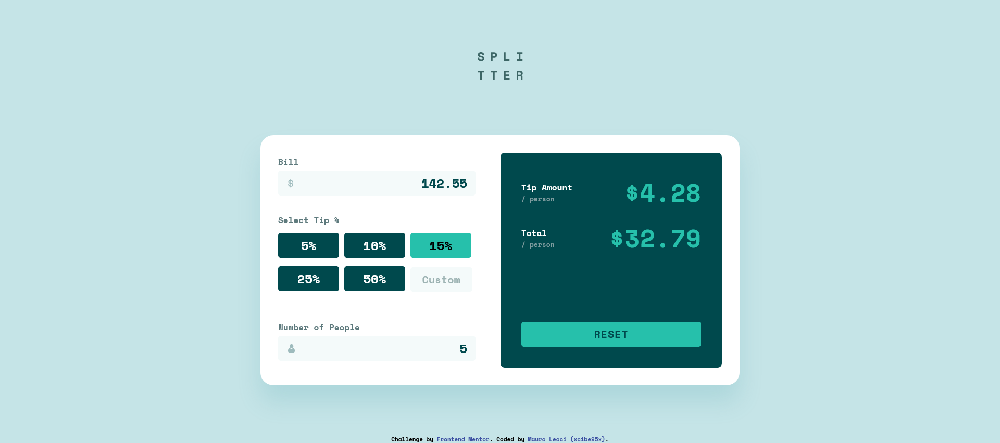

# Frontend Mentor - Tip calculator app solution

This is a solution to the [Tip calculator app challenge on Frontend Mentor](https://www.frontendmentor.io/challenges/tip-calculator-app-ugJNGbJUX). Frontend Mentor challenges help you improve your coding skills by building realistic projects.

## Table of contents

- [Overview](#overview)
  - [The challenge](#the-challenge)
  - [Screenshot](#screenshot)
  - [Links](#links)
- [My process](#my-process)
  - [Built with](#built-with)
  - [What I learned](#what-i-learned)
- [Author](#author)

## Overview

### The challenge

Users should be able to:

- View the optimal layout for the app depending on their device's screen size
- See hover states for all interactive elements on the page
- Calculate the correct tip and total cost of the bill per person

### Screenshot




### Links

- Solution URL: [Add solution URL here](https://github.com/xcibe95x/js-tip-calculator/)
- Live Site URL: [Add live site URL here](https://xcibe95x.github.io/js-tip-calculator/)

## My process

I started by blocking out the html, i made the wireframe of the page and than i proceeded to style it untill i was statisfied with the result, i than started to write down the javascript and went through a bunch of hours of adjustments avoiding most of the ways the user could break the input or get NaN.

### Built with

- Semantic HTML5 markup
- CSS custom properties
- Flexbox
- Desktop-first workflow
- Pure JavaScript

### What I learned

I learned that i can apparently write down a few lines of javascript by my self without googling a lot ahahah
It was a pretty fun experience overall, and it took me 1 hour and 20 minutes to style the page, mostly because of getting the details accourate.

```js
for (i = 0; i < inputRadio.length; i++) {
    inputRadio[i].addEventListener('change', function() {
      inputCustom.value = '';
      calculateTip();
      calculateTotal();
      this.parentElement.classList.add("checked");
      for (i = 0; i < inputRadio.length; i++) {
        if (inputRadio[i] != this) {
        inputRadio[i].parentElement.classList.remove("checked");
        }
      }
    });
}
```
I'm proud of this little code that i wrote that worked like charm and saved me, since i made an array to make the tip% dynamic, and styling the custom radio buttons wasn't easy, so it allows me to add a checked class and change the background and remove it for all other instances of the button that are not selected. 

## Author

- Website - [Mauro Leoci](https://xcibe95x.com)
- Frontend Mentor - [@xcibe95x](https://www.frontendmentor.io/profile/xcibe95x)
- Twitter - [@xcibe95x](https://www.twitter.com/xcibe95x)
